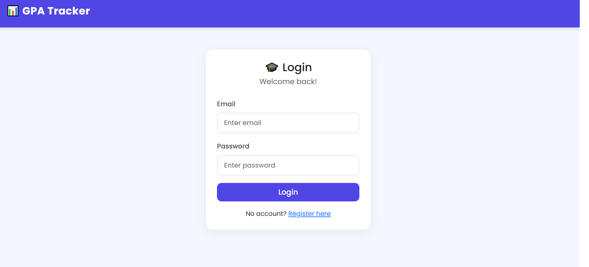
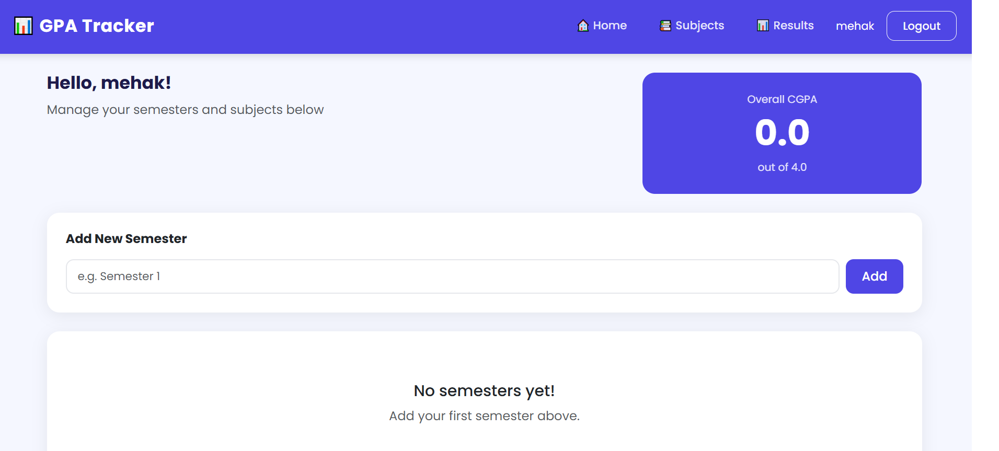
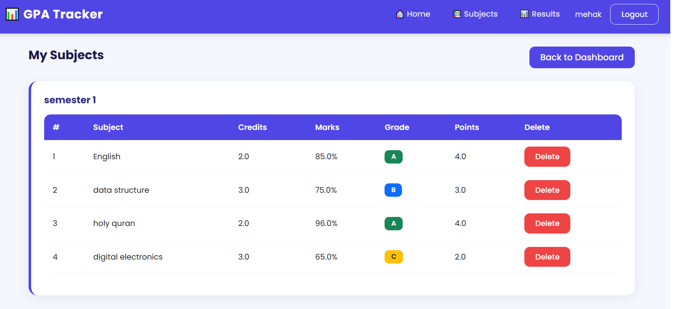
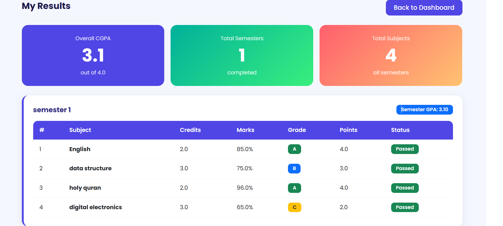

# Student Result and GPA Tracker

A web-based academic management system that enables students to log in, 
enter subject results, and automatically calculate their GPA.

---

## Overview

Student Result and GPA Tracker is a full-stack web application developed 
as part of an academic project in the 6th semester of a Bachelor's in 
Information Technology. The system provides a structured interface for 
managing student results and computing Grade Point Averages based on 
entered data.

---

## Features

- Student authentication and login system
- Subject-wise result entry and management
- Automatic GPA calculation based on entered grades
- Persistent data storage using SQLite
- Clean and responsive web interface

---

## Technologies Used

| Component  | Technology            |
|------------|-----------------------|
| Backend    | Python, Flask         |
| Database   | SQLite                |
| Frontend   | HTML, CSS, JavaScript |

---

## How to Run

**Prerequisites**
- Python 3.8 or above
- pip (Python package manager)

**Steps**

1. Clone the repository

        git clone https://github.com/mehak784/student-result-gpa-tracker.git
        cd student-result-gpa-tracker

2. Create and activate a virtual environment

        python -m venv venv
        venv\Scripts\activate        # On Windows
        source venv/bin/activate     # On macOS/Linux

3. Install required dependencies

        pip install -r requirements.txt

4. Run the application

        python app.py

5. Open in browser

        http://127.0.0.1:5000

---

## Project Structure

    student-result-gpa-tracker/
    |-- gpa_tracker/
    |   |-- static/           # CSS, JavaScript, and image files
    |   |-- templates/        # HTML templates
    |   |-- models.py         # Database models
    |   |-- routes.py         # Application routes
    |   |-- __init__.py       # App initialization
    |-- app.py                # Entry point
    |-- requirements.txt      # Project dependencies
    |-- .gitignore
    |-- README.md

---

## Future Improvements

- Add admin panel for managing multiple students
- Implement PDF export for result transcripts
- Integrate email notifications for result updates
- Deploy the application to a cloud platform

---

## Preview

### Login

### Dashboard

### Subjects

### Results
 

---

## Author

**Mehak**
6th Semester — Bachelor of Science in Information Technology
GitHub: https://github.com/mehak784

